# Projeto Labecommerce

O Labecommerce é um projeto de API realizado no contexto do Bootcamp de desenvilvimento full-stack Labenu. <br>
O objetivo deste projeto é executar algumas funcionalidades típicas de um banco de dados de e-commerce.

## Índice:
- <a href="#tecnologias-utilizadas-">Tecnologias utilizadas</a>
- <a href="#funcionalidades-do-projeto-%EF%B8%8F">Funcionalidades do projeto</a>
- <a href="#endpoints-">Endpoints</a>
- <a href="#exemplos-de-funcionalidades-">Exemplos de Funcionalidades</a>
- <a href="#como-rodar-o-projeto-">Como rodar o projeto</a>
- <a href="#documentação-">Documentação</a>
- <a href="#desenvolvedor-">Desenvolvedor</a>

## Tecnologias Utilizadas 🔬
- Node.js
- TypeScript
- Express
- SQL
- SQLite
- Knex

## Funcionalidades do Projeto ⚙️
- [x]  Get Users: retorna todas as pessoas usuárias;
- [x]  Create User: cadastra nova pessoa usuária;
- [x]  Delete User by ID: remove usuário específico do cadastro;
- [x]  Create Product: cadastra novo produto;
- [x]  Get all Products: retorna todos os produtos cadastrados;
- [x]  Get Product by Name: retorna produto específico pelo parâmetro name (nome);
- [x]  Edit Product by ID: modifica produto cadastrado;
- [x]  Delete Product by ID: remove produto específico do cadastro; 
- [x]  Create Purchase: adiciona pedido de compra;
- [x]  Get purchase by ID: retorna produto específico pelo parâmetro ID.
- [x]  Delete purchase by ID: apaga pedido de compra;

## Endpoints 📌
- Get Users: /users
- Create User: /users
- Delete User by ID: /users/:id
- Create Product: /products
- Get all Products: /products
- Get Product by Name: /products?name=
- Edit Product by ID: /products/:id
- Delete Product by ID: /products/:id
- Create Purchase: /purchases
- Get purchase by ID: /purchases/:id
- Delete purchase by ID: /purchases/:id

## Exemplos de Funcionalidades 💻
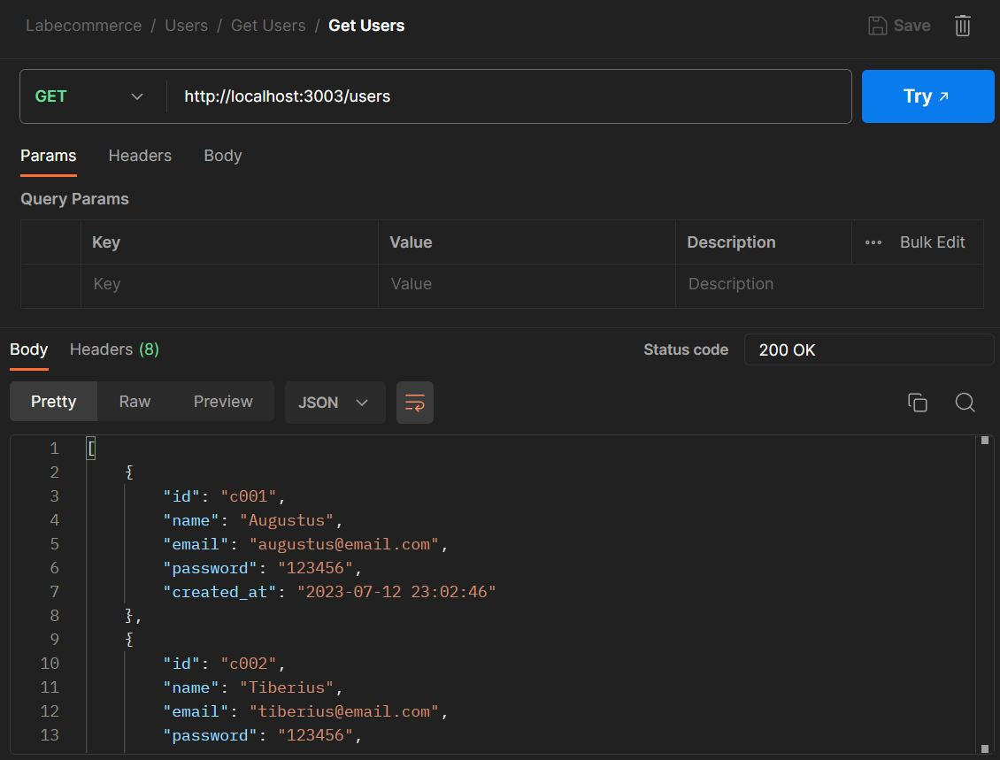
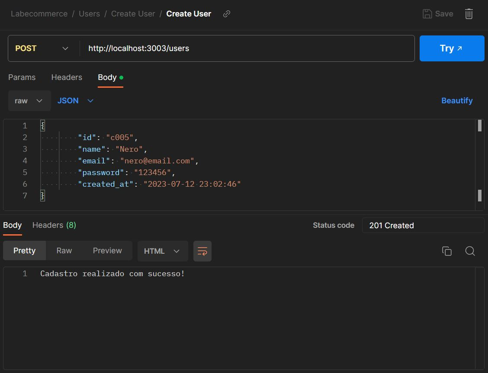
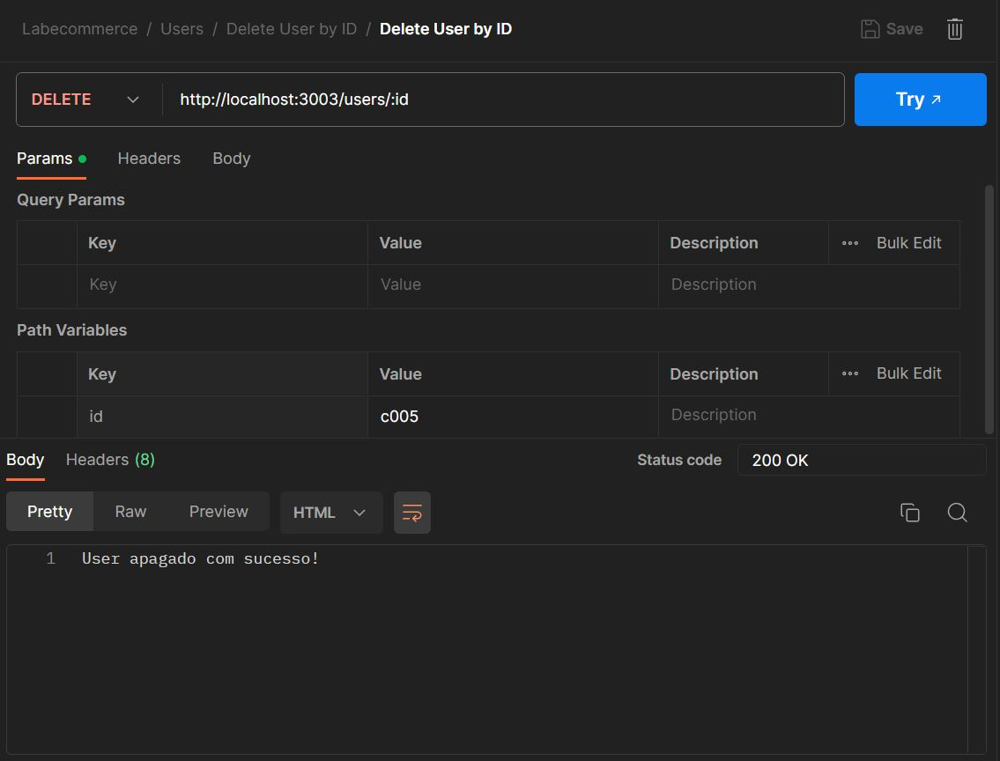
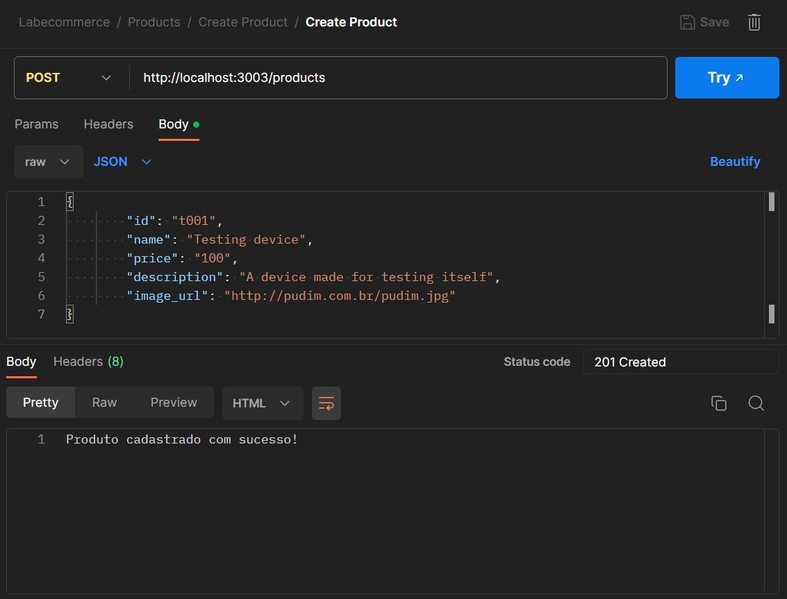
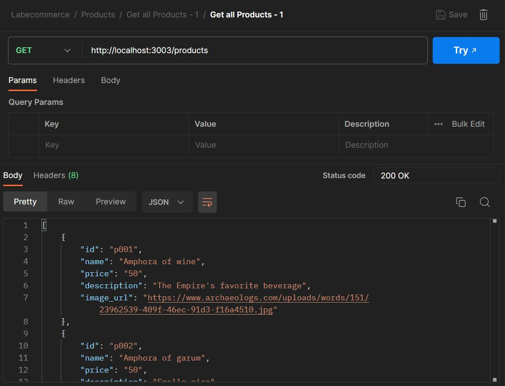
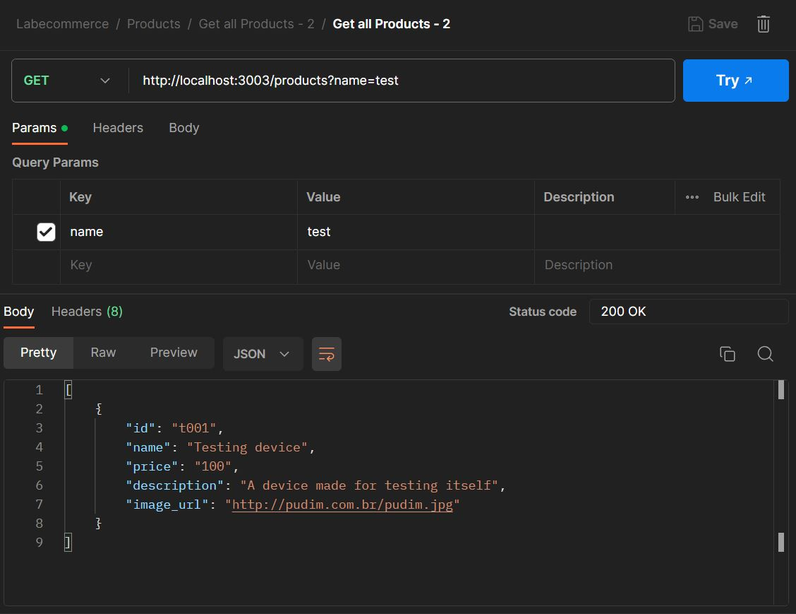
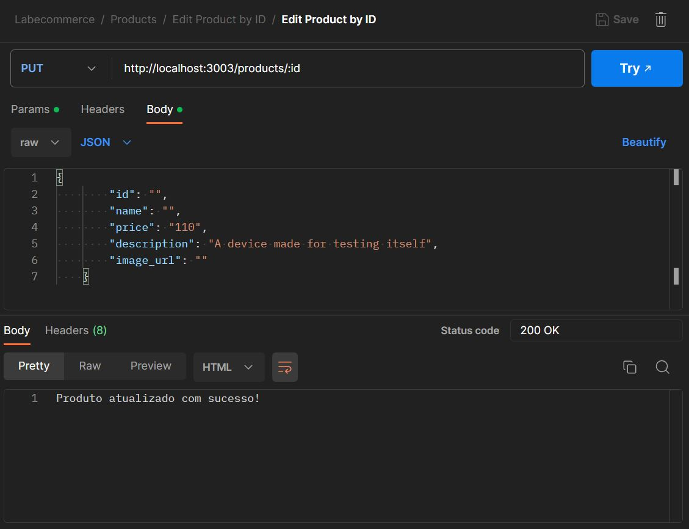
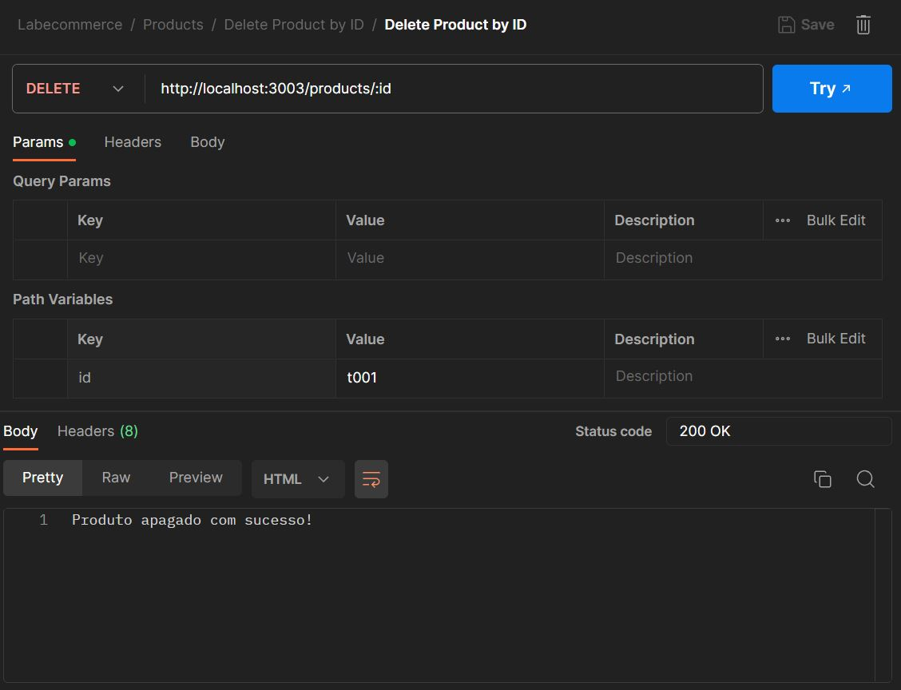
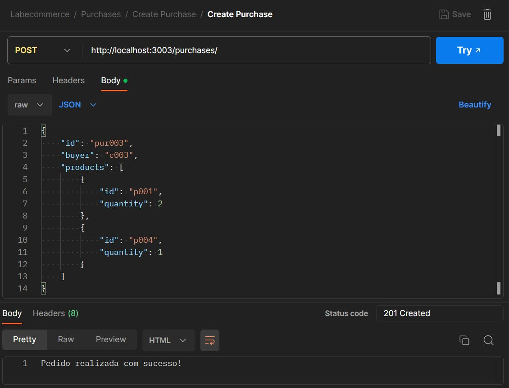
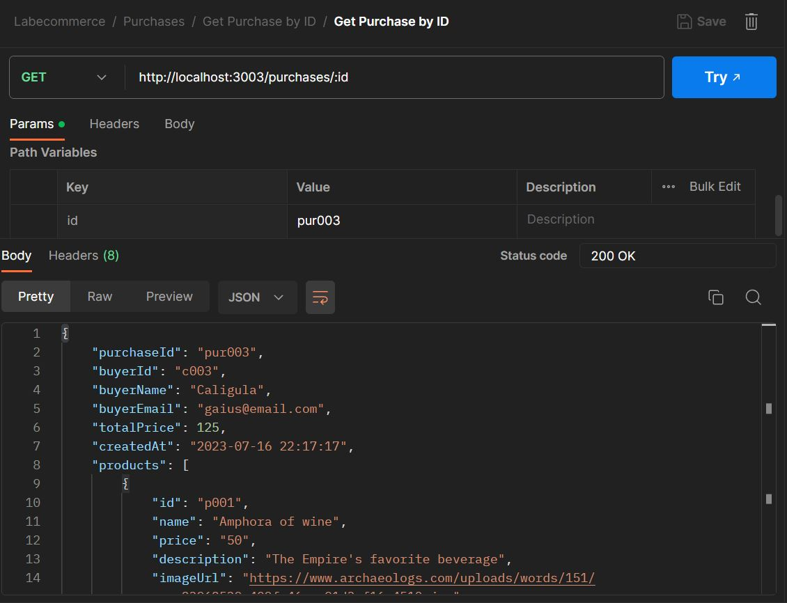
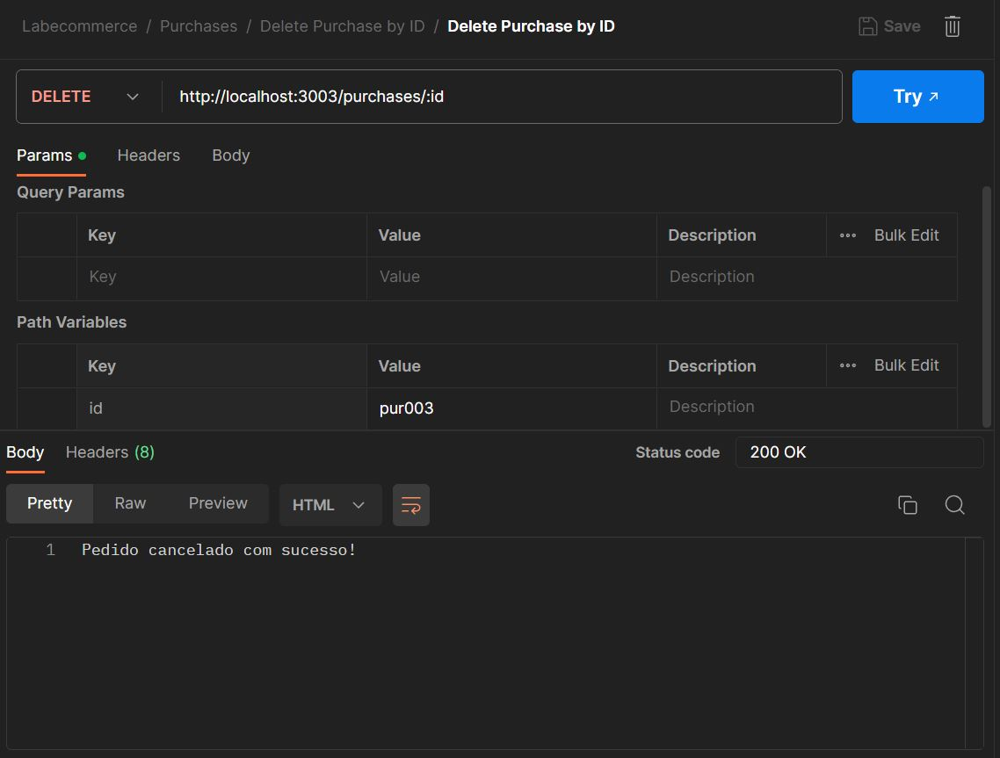

## Como rodar o projeto 🚀

```
# Clone este repositório
$ git clone linkrepo

# Acesse a página do projeto no seu terminal
$ cd endereço-da-página

#Instale as dependências
$ npm install

#Execute a aplicação
$ npm run start
OU
$ npm run dev

#A aplicação será inicializada na porta 3003; acesse pelo navegador por: http://localhost:3003
```

## Documentação 📝
- [Documentação do Projeto no Postman](https://documenter.getpostman.com/view/26594500/2s946feshP){:target="_blank"}

## Desenvolvedor 🤓
### Alexandre R. Alonso
- [Linkedin](https://www.linkedin.com/in/alexandreralonso/)
- [GitHub](https://github.com/AlexRAlonso)
